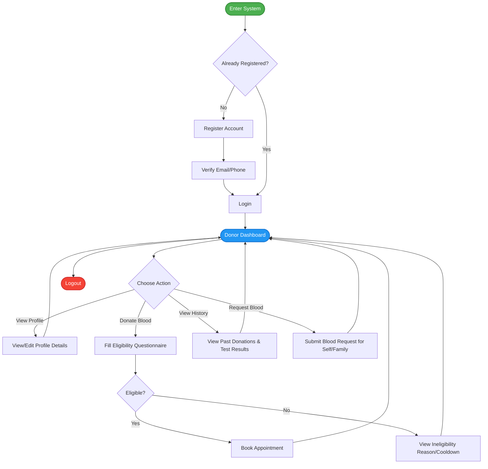
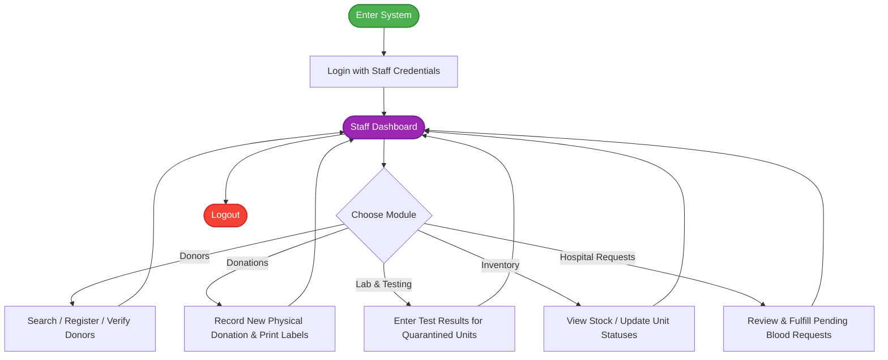

# User Flows

This document outlines the standard user flows for different types of users within the Blood Bank Management System.

## 1. Donor User Flow

This diagram illustrates the journey of a blood donor from entering the system to logging out.

---

## 2. Staff User Flow

This diagram illustrates the journey of a hospital or blood bank staff member (e.g., Receptionist, Lab Tech).

